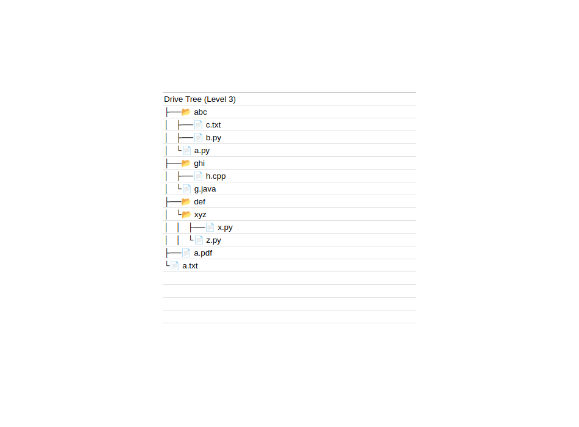

## DriveTree
Tool to show GDrive structure as a tree (like the unix command) in Google Spreadsheet

### OPTION A: Using the tool: Direclty with Google Sheet
1. Duplicate [this sheet](https://docs.google.com/spreadsheets/d/1KO7C2hY9Qv4pUqeCzaSs1lB7xppqbqzTR6AV6rxqGbg/edit?usp=sharing)
2. See the image above how to use it.
3. Click on the DriveTree option in the menu (see last element in main menu). This may take a second for this menu item to appear initially.
4. Now click Generate Tree option under the DriveTree menu item.
5. Give the script permission to access your drive. This script is controlled by you and all data is stored in your sheet. See privacy for more details.
6. Google may give an extra warning that this is unsafe. That is because I haven't registered this app in AppScript Marketplace. If you don't trust this, you can follow the steps in Option B.
7. Now a popup will open. Either you can create a tree from the base of your directory (in which case leave it empty). Else find the folderID of the folder whose subtree you wish to see.
8. Other options are self explanotory
9. This may take time, anywhere from 1-2 mins to say 30mins depending on the size of your drive. Try to test with small folders first and then try larger.

### OPTION B: Use the code given here and setup AppScript by yourself
1. Create a new sheet
2. Click on Extension and then AppScript under it
3. Now create two files called code.gs and form.html and paste the cotents of the respective files inside those files
4. Now follow steps 2-8 from Option A. You will not see the unsafe warning in step 6.

### Privacy
We build this with privacy in mind and wanted a tool that does not expose any of our data. Hope this helps.

1. We collect no data from you, everything is stored in your sheet. There is no usage tracker, nothing. Doesn't even use any extra packages either.
2. You can view the code here in code.gs and form.html to verify the same.
3. You can view the code being used in a sheet by clicking on 'Extensions' in the menu and then click 'AppScript'. You can verify the code there in code.gs and form.html with the ones in this repo.
4. Alternatively, you can create use the code.gs and form.html given here to populate the same in AppScript directly.
5. You can check with any of the online coding tools to verify that this does not leak any data or verify it yourself.

PS: This is experimental, so please bare with us.
